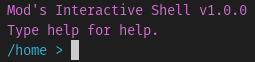

[codelines-shield]: https://img.shields.io/tokei/lines/github.com/ModMonster/mish?label=Lines%20of%20code&style=for-the-badge
[codelines-url]: https://github.com/modmonster/mish
[version-shield]: https://img.shields.io/github/v/tag/ModMonster/mish?label=Latest&style=for-the-badge
[version-url]: https://github.com/modmonster/mish/releases
[commits-shield]: https://img.shields.io/github/commits-since/modmonster/mish/v1.0.0-alpha/master?label=commits&style=for-the-badge
[commits-url]: https://github.com/modmonster/mish/commits/master
[latestcommit-shield]: https://img.shields.io/github/last-commit/ModMonster/mish?label=Latest%20Commit&style=for-the-badge

[![Lines of Code][codelines-shield]][codelines-url]
[![Release][version-shield]][version-url]
[![Commits][commits-shield]][commits-url]
[![Latest Commit][latestcommit-shield]][commits-url]

[screenshot]: https://raw.githubusercontent.com/ModMonster/mish/master/logo.png

<!-- PROJECT LOGO -->
 

  
  

    Mod's Interactive Shell, aka Mish is a simple shell made in Python. 
     
     
    <a href="https://github.com/ModMonster/Mish/issues">Report Bug</a>
    ·
    <a href="https://github.com/ModMonster/Mish/issues">Request Feature</a>
  

<!-- TABLE OF CONTENTS -->

  
<h2 style="display: inline-block">Table of Contents</h2>

  <ol>
    <li>
      <a href="#what-is-mish">What is Mish?</a>
    </li>
    <li>
      <a href="#getting-started">Getting Started</a>
      <ul>
        <li><a href="#dependencies">Dependencies</a></li>
        <ul>
          <li><a href="#required">Required</a></li>
          <li><a href="#optional">Optional</a></li>
        </ul>
        <li><a href="#installation">Installation</a></li>
      </ul>
    </li>
    <li><a href="https://github.com/modmonster/mish/wiki">Wiki</a></li>
    <li><a href="#contact">Contact</a></li>
  </ol>

<!-- ABOUT THE PROJECT -->
## What is Mish?

This is a basic shell made to test my skill in Python. It's a modular shell with easily customizable commands.

<!-- GETTING STARTED -->
## Getting Started

Follow these steps to download Mish and install it on your computer.

### Dependencies

Apart from the obvious Python 3, these are the dependencies you need to use Mish. All of these can be installed through pip.

#### Required
These dependencies are required for Mish to operate.

os
importlib - (installer)

#### Optional
If you want to run a certain command, you will need the following dependencies. Make sure you have them installed before attempting to run the command.

installer - (easygui, will work without it but will not have graphical directory picker.)
 
rm - (shutil)
 
mash - (urllib, requests, importlib)
 
stopwatch - (time, threading, math)
 
timer - (time, threading, math)

### Installation

1. Download the latest version of mish_install.py from https://github.com/modmonster/mish/releases
2. Run the file with Python 3.
3. Follow the installer's instructions.
4. Run mish.py from within the shell folder of your installation.

<!-- CONTACT -->
## Contact

ModMonster - [youtube.com/modmonster](https://youtube.com/modmonster) - modmonster2060@gmail.com

Project Link: [https://github.com/ModMonster/Mish](https://github.com/ModMonster/Mish)
